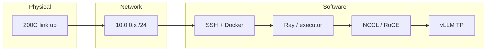

# DGX Spark cluster compass

> **Disclaimer:** This repository is **not** affiliated with NVIDIA. It is community documentation from someone who burned a multi-day weekend (and several weeknights) proving that two Sparks plus a 200G cable are **not** plug-and-play—and mapping where the stack actually breaks. NVIDIA’s playbooks and containers remain the source of truth; this repo is a **compass** so you spend less time lost between layers.

**Why this exists:** I bought a second DGX Spark, connected the cluster cable, assumed the software path would be obvious, and instead walked every layer from L3 to NCCL to vLLM until it finally held. If this saves you even one Saturday of dead ends, it did its job.

If it helped you, **consider starring the repo** so the next person finds it faster.

A **human-readable map** for people who are new to clustering two (or more) **NVIDIA DGX Spark** units. Connecting Sparks with a high-speed link is **not** plug-and-play: you must succeed at several independent layers before tensor-parallel inference “feels like one brain.”

## Fast track — interactive wizard

**Want a guided pass through the handshakes on the metal?** Open **[`wizard/setup_guide.ipynb`](wizard/setup_guide.ipynb)** in JupyterLab on your **head Spark** (not your laptop). It walks **network → GPU symmetry → RoCE GID hints → zombie VRAM check → eugr launch command → optional health monitor**, with **gates** between layers. Install deps from [`wizard/requirements-wizard.txt`](wizard/requirements-wizard.txt).

## At a glance (stack)

## Who this is for

- You bought multiple Sparks and expected the interconnect to “just work.”
- You are comfortable on the command line but have not clustered GPUs before.
- You want to **know where failures actually live** (network vs. SSH vs. Ray vs. NCCL vs. vLLM vs. weights on disk).

## How to use this repo

0. **Optional but recommended:** run the [**wizard notebook**](wizard/setup_guide.ipynb) on the head node for a single “console” through the layers.
1. Read [**Clustering stack (layers and handshakes)**](docs/clustering-stack.md) once. It explains what must succeed, in order, and includes diagrams.
2. Keep [**Operational playbook**](docs/playbook-commands.md) handy when you launch or recover from a bad state.
3. When something breaks, start with [**Troubleshooting and pitfalls**](docs/troubleshooting-and-pitfalls.md) and map the symptom back to a layer.
4. Use [**References**](docs/references.md) for authoritative upstream docs (NVIDIA playbook, community Docker/Ray/vLLM stack).

## Mental model in one sentence

**Clustering** here means: physical link → correct IPs → SSH and orchestration (often Ray) → **NCCL** over RDMA/Ethernet for GPU collectives → **vLLM** with **tensor parallelism (TP)** split across nodes → a single API that uses **all** GPUs as one logical model—**if** every layer above agrees on addresses, ports, devices, and file paths.

### Physical prerequisites (before any script matters)

- **Interconnect:** Cluster cable seated; link **up** at the speed you expect (e.g. 200G-class fabric—not “I have a cable” but “the NICs agree the link is healthy”).
- **Cluster subnet:** Dedicated L3 for Spark-to-Spark traffic (example pattern: **`10.0.0.0/24`**, head `10.0.0.1`, worker `10.0.0.2`) with **bidirectional** `ping`.
- **Symmetric GPUs:** Before multi-node TP, both nodes should show **clean, comparable free VRAM** (`nvidia-smi`). Asymmetric “mystery” usage on one node will break planners and collectives long before “the model” is wrong.

## “One brain” vs. “two models”

These sound similar but impose different constraints:

- **One logical model across both Sparks (TP = 2)**  
  One vLLM (or equivalent) **server**; the model is **sharded** across two GPUs. You usually need a **full copy of the weights on each node** (or shared storage), and NCCL must be healthy. This is what most “connect the cable for more VRAM” guides are aiming at.

- **Two different models at the same time**  
  Two **separate** serving processes (different ports or orchestrators), each owning its GPUs. Cluster networking still matters if processes coordinate, but you are not doing one tensor-parallel group across both GPUs unless you explicitly configure that.

This compass focuses on **making the stack legible** so you can get the first case reliable; the second case is mostly **capacity planning** (VRAM per model) plus **process layout**, once each GPU is trustworthy in isolation.

## Upstream projects you will actually use

| Resource | Role |
|----------|------|
| [NVIDIA DGX Spark Playbooks — Connect two Sparks](https://github.com/NVIDIA/dgx-spark-playbooks/tree/main/nvidia/connect-two-sparks) | Baseline physical + OS + SSH + network expectations. |
| [eugr/spark-vllm-docker](https://github.com/eugr/spark-vllm-docker) | Dockerized vLLM + `launch-cluster.sh`, Ray, NCCL-oriented env, recipes. |

This compass **does not replace** those repos; it **orients** you inside them.

## From compass to application

- **[`examples/langgraph-connection.py`](examples/langgraph-connection.py)** — minimal **LangGraph** + `ChatOpenAI` pointed at `http://<head>:8000/v1` (OpenAI-compatible vLLM). Install deps with [`examples/requirements-langgraph.txt`](examples/requirements-langgraph.txt).

## Contributing

If you hit a new failure mode and found the fix, consider adding a short entry to `docs/troubleshooting-and-pitfalls.md` or a command snippet to `docs/playbook-commands.md` so the next person spends fewer weekends on the same wall.
