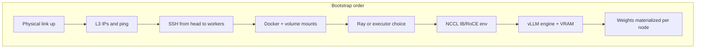
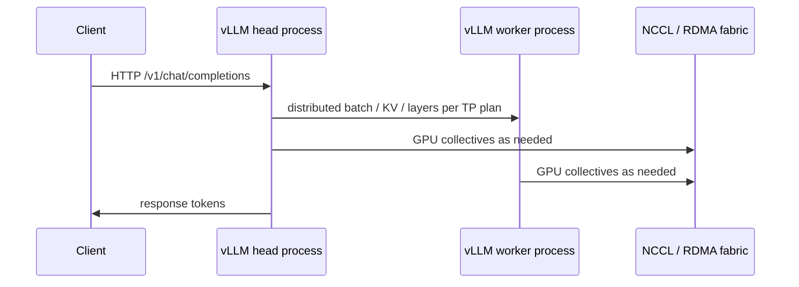
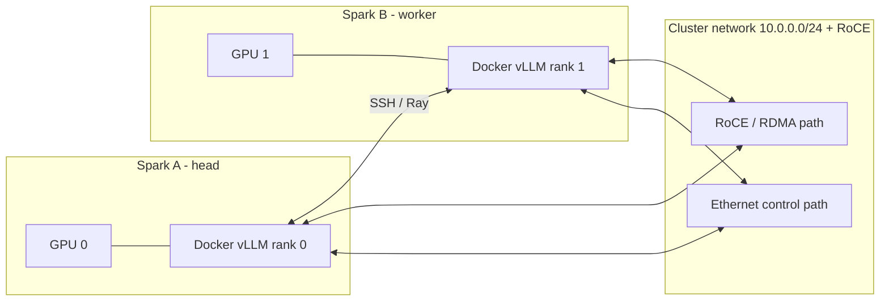

# Clustering stack: layers and handshakes

When people say they want two Sparks to run **“one giant brain,”** they usually mean **one vLLM (or similar) server** using **tensor parallel** across **both** GPUs. That outcome depends on a **stack of handshakes**. If something fails, the error message often appears **far above** the layer that actually broke (for example, a hang during model init is often **NCCL**, not the attention kernel).

The following order is the one you should use when **debugging**: prove layer *N* before spending hours on layer *N+1*.

---

## Layer 0 — Physical interconnect

**What must be true**

- Cables seated, link up, correct topology (follow NVIDIA’s playbook for your kit).
- You know which NIC names map to **cluster traffic** vs. management LAN.

**Typical Spark naming (example from real setups; yours may differ)**

- Ethernet: `enp1s0f0np0` (or similar)
- RoCE / IB device: `rocep1s0f0` (or similar)

**Failure signals**

- No carrier, wrong interface in scripts, autodiscovery hanging for minutes because the script is probing the wrong device.

---

## Layer 1 — L3 connectivity (IP addresses)

**What must be true**

- A **dedicated subnet** for Spark-to-Spark traffic (example: `10.0.0.0/24` with head `10.0.0.1`, worker `10.0.0.2`).
- `ping` works **both directions** on that subnet.

**Failure signals**

- Intermittent SSH, Ray gossip timeouts, NCCL “cannot connect” after long waits.

---

## Layer 2 — SSH and “where commands run”

**What must be true**

- Passwordless SSH between nodes for the account that runs cluster scripts (per NVIDIA playbook).
- **Cluster launch scripts run on the head** (or on a host that has the same GPUs, Docker, and network interfaces as the Sparks—not your laptop).

**Failure signals**

- Scripts referencing interfaces that exist only on the Spark, run from a laptop.
- `scp` confusion: laptop paths vs. Spark paths.

---

## Layer 3 — Docker + bind mounts (filesystem contract)

**What must be true**

- Containers often use **`--network host`** and mount **`~/.cache/huggingface` → `/root/.cache/huggingface`**.
- Anything not under that mount is **invisible** inside the container unless you add more `-v` flags or extra Docker args.

**Failure signals**

- “Model not found” while the file exists on the host under a path that is not mounted.
- Checking `/root/.cache/...` **on the worker host** as a normal user (permission denied); use your user’s `~/.cache/...` on the host, or inspect **inside** the container.

---

## Layer 4 — Orchestration (Ray or not)

**What must be true**

- If using Ray: head and workers agree on addresses and ports; firewall does not block Ray’s control plane.
- Ray being “up” does **not** guarantee NCCL or vLLM will succeed; it only means **this** orchestration layer is alive.

**Failure signals**

- Ray dashboard looks fine but model startup hangs (look at NCCL / vLLM next).

---

## Layer 5 — NCCL / RDMA “steering”

**What must be true**

- NCCL can reach the **correct** HCA and GID for RoCE on your fabric.
- Mis-steering often surfaces as **indefinite waits** during distributed init—sometimes misread as FlashAttention.

**Useful direction (examples, not universal constants)**

- `NCCL_IB_HCA=rocep1s0f0`
- `NCCL_IB_GID_INDEX=<index for your RoCE fabric>` (discover empirically; “3” appears in some working setups)

**Failure signals**

- Hang at distributed init, mysterious multi-minute stalls, errors mentioning IB/RDMA after scaling beyond one node.

---

## Layer 6 — vLLM engine + memory profile

**What must be true**

- vLLM version / engine (V0 vs. V1) matches what your image and recipes expect.
- Enough **free VRAM** on **each** GPU; zombie processes skew “free memory” and break planners that assume a clean GPU.

**Failure signals**

- VRAM reservation failures on one node only (suspect stray processes or asymmetric load).
- Warnings such as **SymmMem** capability not supported—treat as a hint to **simplify** the engine path or adjust image/recipe, not as noise.

---

## Layer 7 — Weights on disk (Hub layout vs. materialized files)

**What must be true**

- For **multi-node TP**, each node needs the weights available **locally** at the path the container sees (via the mount), unless you have true shared storage.
- Hugging Face **hub cache layouts with symlinks** into `blobs/` can break loaders that expect plain files in a snapshot directory.

**Practical pattern that often works**

1. Materialize a model to something like  
   `~/.cache/huggingface/materialized/<org>-<model>`  
   (real `*.safetensors` / `*.bin` files, not broken symlinks).
2. `rsync` that directory to the same path on peer nodes.
3. Point `MODEL_ID` (or equivalent) at **`/root/.cache/huggingface/materialized/...`** inside the container.

**Failure signals**

- `Cannot find any model weights` even though `ls` on the host “looks” fine (often symlink or mount issues).

---

## Layer 8 — Load path performance (optional but real on Spark)

**What must be true**

- Some Spark-oriented READMEs recommend **`--load-format fastsafetensors`** because default mmap-heavy paths can be slow.

---

## Diagram: request flow vs. setup handshakes

**Setup** (what you must get right before serving):

**Runtime** (simplified single client request):

---

## Diagram: two Sparks, TP=2 (one logical model)

---

## How to use this when something breaks

1. **Classify the symptom** (ping? SSH? Docker? Ray? hang at init? loader error?).
2. **Map it to the lowest layer** that could still be wrong.
3. **Fix that layer and re-verify** before changing five env vars at once.

If you change multiple layers simultaneously, you will not know what actually fixed the issue—and the next upgrade will hurt just as much.
